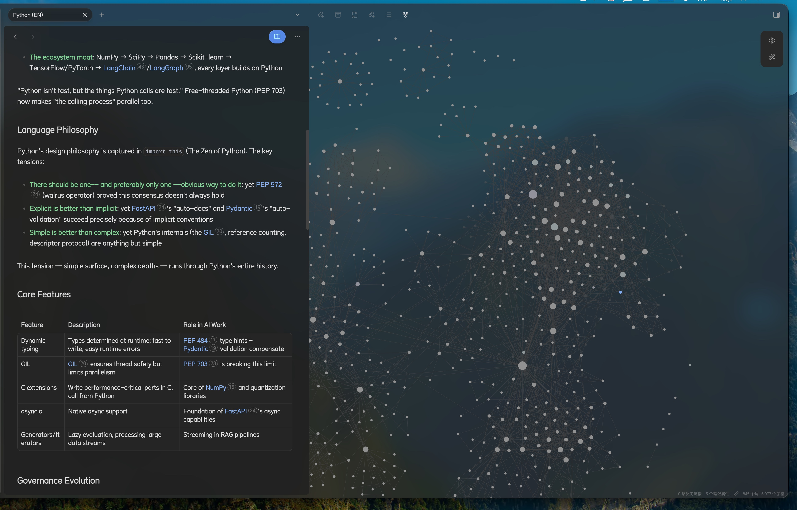
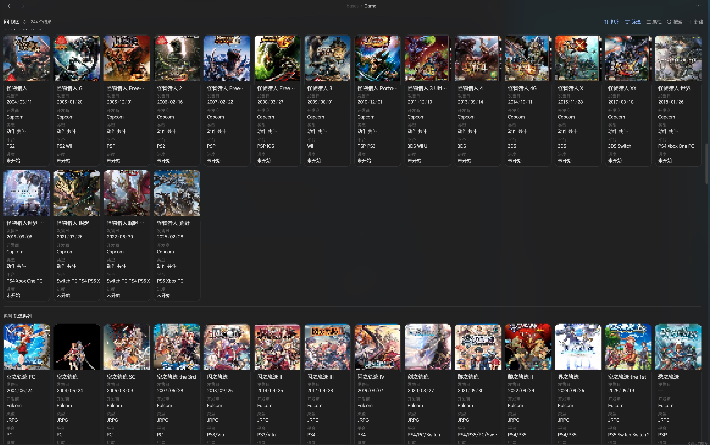
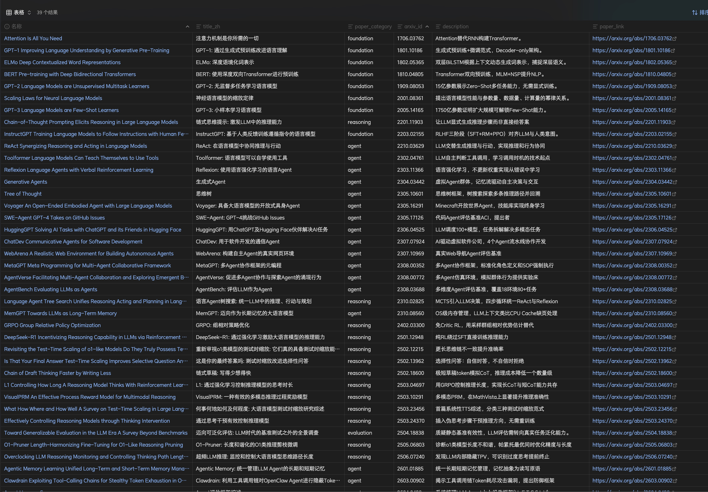
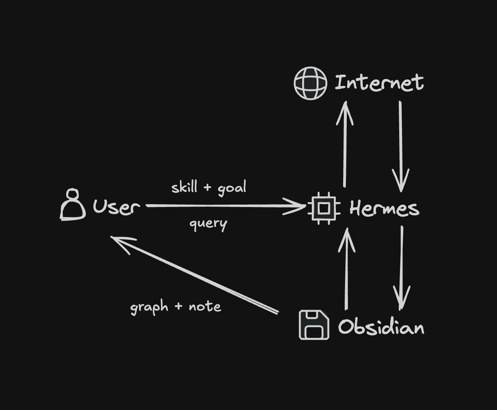

# Vibe-Learning

<p align="center">
  
</p>

[](https://opensource.org/licenses/MIT)
[](https://obsidian.md/)

AI 先学，整理好，你再读。基于 Obsidian 的个人认知增强系统。

[English](README.md)

## 为什么做这个

大部分时候你是知道什么有用的——那篇论文值得读、那本书讲的东西跟你正在做的事有关。问题是你没时间没精力去消化。

信息爆炸不是新鲜词了。每天刷到的好文章比你能读的多十倍，收藏夹越堆越厚，焦虑越积越重。不是不学，是打开一看就觉得"这又得花两小时"，关掉，然后愧疚。认知过载不是你的问题，是这个时代的信息密度和你的消化能力之间有个结构性缺口。

Vibe-Learning 让机器接手这些脏活——检索、提取、格式化、建立关联，用 Obsidian 的 graph 和 base 把知识结构化呈现。你只做一件事：判断"这对不对、我认不认同、跟我有什么关系"。从你关心的根问题出发，图谱往外长，不是照着别人的目录往里塞。

**而你真正需要做的，就是泡杯咖啡，读那些为你量身打造的知识卡片。** 不是啃论文原文，不是在海量信息里找重点——AI 已经替你嚼碎了、排好了、连上了。你只需要理解和判断。

<table>
  <tr>
    <td align="center" width="50%"><b>游戏卡片 — Bases 视图</b></td>
    <td align="center" width="50%"><b>论文卡片 — Bases 视图</b></td>
  </tr>
  <tr>
    <td></td>
    <td></td>
  </tr>
</table>

每张卡片带结构化的 frontmatter，卡片之间用 wikilink 互链，Bases 里当数据库用。验证脚本保证几百张卡片格式统一。

## 核心理念

Vibe-Learning 是一个个人认知增强系统，让 AI 先把知识学透、整理清楚，再辅导你来学。AI 学的过程中积累你的记忆和知识图谱，做自我蒸馏和人类对齐——你认同什么、在意什么、怎么想问题，这些全部沉淀在系统里，越用越懂你。

它能帮你搞定两类信息：**知道有用但不知道怎么消化的**（收藏了一堆论文/文章但没时间处理），和**不知道去哪搜的**（有了兴趣点但找不到靠谱入口）。

而且这不是一次性的——每次对话都在积累。Vault 是你和 Agent 共享的上下文，Agent 读你的图谱就知道你关心什么、已经了解什么、哪些领域要深挖。不用每次从零开始解释"我是谁、我在学什么"。你的知识图谱越丰满，Agent 的输出越精准。

具体怎么做？五个环节：

1. **信源检索** — 动态搜索优质信源，不写死不搬运，优先一手材料
2. **信息格式化** — 提取核心概念，按统一 schema 建结构化卡片，不是复制粘贴存一段话
3. **知识关联** — 用 Obsidian 的 graph 和 base 建立卡片间的关联，看到脉络而不只是孤立事实
4. **以个人为根节点** — 知识图谱从你关心的领域往外长，不是照着别人的分类体系往里填
5. **人机共同维护** — Agent 负责检索、建卡、连关联等体力活；你负责判断"这对不对、我认不认同"；你的反馈持续校准 Agent 对你的理解

> **小心"流畅性幻觉"**（Rhodes & Castel, 2008）
> 机器把整理好的东西递过来，大脑会觉得"读得顺＝我懂了"。系统把起跑线往前挪了，但路还是自己跑。

### 三层结构

| 层 | 存什么 | 举个例子 |
|----|--------|----------|
| **Agent Memory** | 不变的事实——你是谁、在意什么 | "这个用户偏好简洁回复" |
| **Skills** | 怎么操作——卡片怎么建、字段怎么填、怎么验证 | 本仓库 |
| **Vault** | 你知道的一切——知识图谱本身 | 你的 Obsidian 笔记库 |

### 五个方法

1. **洋葱原则** — 知识是分层的，上面是概括，往下是细节。每一层自己能读。
2. **脉络思维** — 别追定义，追演化。"这东西从哪来？中间变了什么？为什么？"比"它是什么？"有用得多。
3. **渐进展开** — 根卡片是入口，每个段落链接到更深的子卡片。先看摘要，想深入再点进去。
4. **种子生长** — 不是什么都值得等量投入。选几个你真正在乎的"种子"集中浇。其他碰到再记，不追。
5. **问题驱动** — 按"我现在要解决什么问题"来组织，别按学术分类来。

<p align="center">
  
</p>

## 仓库里有什么

```
skills/
├── vibe-learning/SKILL.md              # 方法论总览（先看这个）
├── note-schema/SKILL.md                # 数据模型：类型、字段、命名
├── note-schema/scripts/
│   └── validate_frontmatter.py         # frontmatter 验证 + 自动修复
├── research-paper/SKILL.md             # 论文卡片完整工作流
└── game-card/SKILL.md                  # 游戏卡片完整工作流
```

这四个 skill 是给 [Hermes Agent](https://github.com/NousResearch/hermes-agent) 写的，但里面的方法和 schema 跟什么 Agent 都能用。

```
vibe-learning (方法论)
├── note-schema (数据模型 + 验证)
├── research-paper (论文)
└── game-card (游戏)
```

每个 skill 自成一体但互相引用。先看 `vibe-learning` 了解全貌，或者直接按需加载。

### 卡片类型

三种：实体（人、技术、游戏、组织……）、过程（论文、决策、项目……）、元数据（汇总、反思、日志……）。完整列表见 `note-schema`。

### Frontmatter 规则

- 文件第一个字符必须是 `---`（不然 Obsidian Bases 会出问题）
- frontmatter 里不要用 `[[]]`，放正文
- 数组写一行：`platform: ["PS5", "PC"]`
- 不用 `tags` 字段——wikilink 比 tag 信息量大
- 空字段直接删，别留着 `[]`

### 验证脚本

```bash
# 扫一个目录
python skills/note-schema/scripts/validate_frontmatter.py your-vault/cards/

# 只检查论文卡
python skills/note-schema/scripts/validate_frontmatter.py cards/ --type paper

# 自动修复
python skills/note-schema/scripts/validate_frontmatter.py cards/ --fix

# 用自己的 schema（内置只覆盖 paper 和 game）
python skills/note-schema/scripts/validate_frontmatter.py cards/ --schema my-schema.json
```

## 快速开始

### 你需要 Obsidian

[Obsidian](https://obsidian.md) 是本地优先的 Markdown 笔记应用，个人免费。Vibe-Learning 用到它这几个能力：

- **Wikilinks**（`[[卡片名]]`）链接卡片
- **YAML frontmatter**（文件开头的 `---` 块）存结构化数据
- **图谱视图**看关联
- **Bases**（核心插件）把卡片当数据库用

### 安装 Skills

**方案 A：Hermes Agent（推荐）**

[Hermes](https://github.com/NousResearch/hermes-agent) 会自动读取 skill 文件，按工作流帮你维护笔记库。

```bash
# 装 Hermes
pip install hermes-agent

# 克隆到 skills 目录
# macOS/Linux 默认：~/.hermes/skills/
# Windows 默认：%USERPROFILE%\.hermes\skills\
git clone https://github.com/slow-coding/vibe-learning-skill.git <skills-dir>/vibe-learning-skill

# 确认——应该看到 4 个 skill
hermes skills list
```

Hermes 会递归发现所有 SKILL.md，4 个 skill（含验证脚本）立即可用。开个新 session：

```
/skill vibe-learning
帮我建一张论文卡片，arxiv 2401.12345
```

**方案 B：Claude Code 或其他 Agent**

克隆到哪都行，在 Agent 的指令文件里引用 SKILL.md：

```bash
git clone https://github.com/slow-coding/vibe-learning-skill.git
```

Claude Code 用户在项目 `CLAUDE.md` 里加：

```markdown
## Vibe-Learning Skills
读取并遵循以下 skill 文件：
- <repo-path>/skills/vibe-learning/SKILL.md — 方法论
- <repo-path>/skills/note-schema/SKILL.md — 数据模型
- <repo-path>/skills/research-paper/SKILL.md — 论文卡片
- <repo-path>/skills/game-card/SKILL.md — 游戏卡片
```

**方案 C：不用 Agent 也行**

schema、方法论、验证脚本都可以单独用：

```bash
python <repo-path>/skills/note-schema/scripts/validate_frontmatter.py your-vault/cards/
```

---

## 适合谁

你的 Obsidian 里已经有几十张以上带 frontmatter 的笔记，并且你经常觉得"我写过这个东西但找不到"。

或者你用 AI Agent 辅助工作，但它的输出每次格式都不一样，你花在整理上的时间比花在理解上的还多。

或者你看一篇文章的第一反应是"这跟我之前看的那篇有什么关系"，而不是"这讲了什么"。

如果以上都不是你，这个项目对你可能没用。

## 不做什么

- **不写百科** — 一张卡片如果跟 Wikipedia 条目没区别，说明它缺了一个关键的东西：你为什么把它放进你的库。每张卡必须回答"这改变了我的什么判断或行动"。
- **不用标签** — `[[memory]]` 比 `#memory` 多了方向性：从哪来、往哪去。Tag 只能搜，link 能走。
- **不预先填满** — 没读过的不写摘要，没玩过的不写评测。空着比编好。
- **不按分类导航** — 卡片多了以后，入口不是"AI → 推理 → CoT"，是"我想了解思维链怎么从提示词工程演化到独立推理能力的"。
- **不用 AI 替你思考** — AI 把一篇论文拆成结构化卡片，30 秒。但你读卡片时问的"我同意吗？这让我想到什么？"——这个过程不能跳过。跳过了就是记忆面包，吃下去不会了。

## 许可证

MIT

## 致谢

基于 [Hermes Agent](https://github.com/NousResearch/hermes-agent) 和 [Obsidian](https://obsidian.md) 构建。
